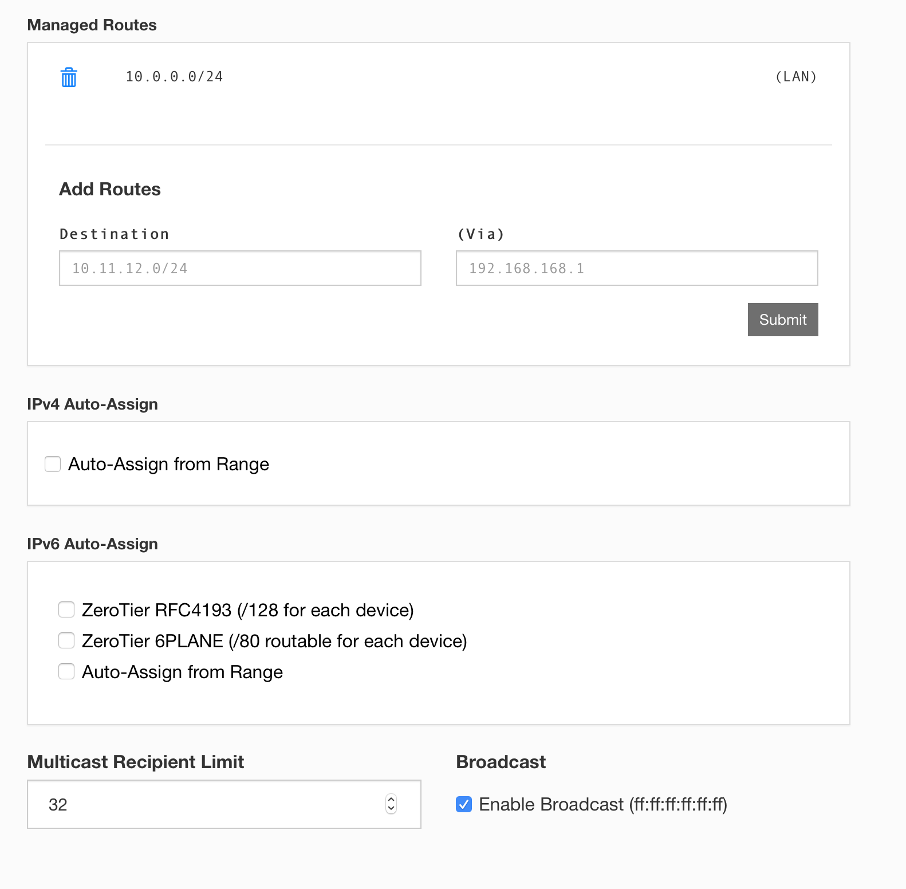
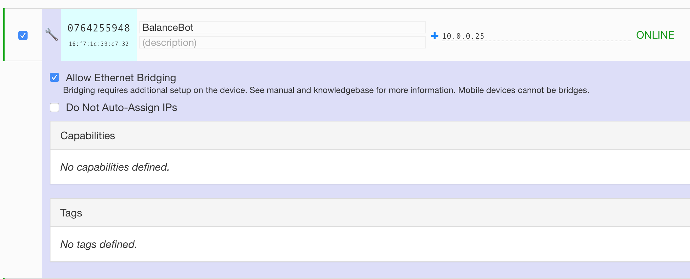

# RemoteVPN
Allows to connect to the robot from anywhere in the world


## Network Setup


Go to [my zerotier](https://my.zerotier.com) and make an account. From there you can create a network with those settings:




Any device that joins this virtual network will behave as if it connected to an ethernet switch with all the other devices. 


#### Install on RPi

```sudo bash install.sh``` 

To join a network type ```zerotier-cli join XYZ``` where `XYZ` is the network ID. 

Make a backup of `/etc/network/interfaces` (`cp /etc/network/interfaces /etc/network/interfaces.back`)
and replace it with `mv zeroteir_interfaces /etc/network/interfaces` and edit it to have the correct IP and the zerotier network name (which can be found with `ifconfig`) 

You will have to authenticate the device from the network interface. Additionally allow Ethernet Bridging to access devices on the ethernet network via the VPN. Type in the PI's ip as shown:



Note: To be able to ssh into the pi you will need to remove the `ListenAddress` lines at the bottom of `/etc/ssh/sshd_config` which will enable people to ssh from WiFi. This is a security issue so either change the password (and document it somewhere) or setup key based login.

Note: It is quite possible to get locked out during this process so have a SD card reader and/or UART adapter ready to ger access to the pi


#### Install on Mac

follow instructions on [here](https://www.zerotier.com/download/)


